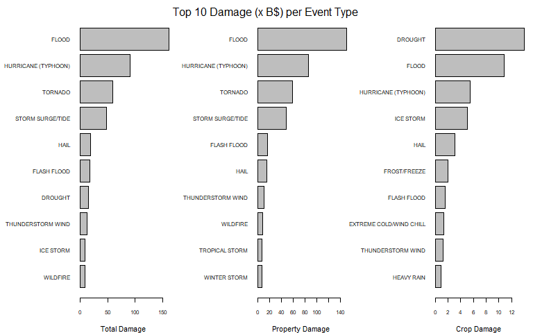
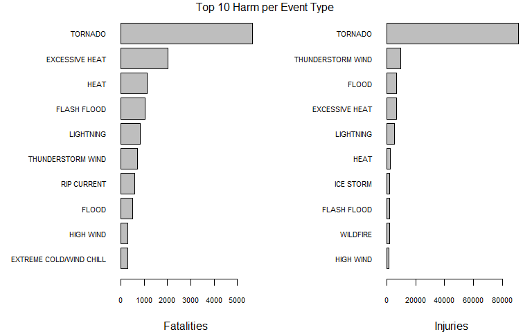

# Synopsis

The storm data was obtained from [NOAA](https://www.ncdc.noaa.gov/stormevents/details.jsp) and consists of weathertypes that cause damage or harm. The collection of data is between 1950 and 2016.

Impact on properties and crops:  
Over the years flooding causes the most damage to properties and crops. Looking only at crop damage drought is the biggest cause.

Harm:  
Most fatalities and injuries are caused by tornados. Heat is also a big cause for fatalities, whereas storm and flooding causes more injuries. 

# Data Processing

The data is provided by the Coursera website. Package `dplyr` is used.

## Getting the data


```r
url <- "https://d396qusza40orc.cloudfront.net/repdata%2Fdata%2FStormData.csv.bz2"
fname <- "data/StormData.csv.bz2"
if(!file.exists(fname))
    download.file(url, fname, mode = "wb")

dfStorm <- read.csv(fname) %>% tbl_df()
```

We don't need all variables, so select only those relevant for the analysis:


```r
dfEvtype <- select(dfStorm, one_of(c("EVTYPE", "FATALITIES", "INJURIES", "PROPDMG", "PROPDMGEXP", "CROPDMG", "CROPDMGEXP")))
```

The National Weather Service provides the types of events in the dataset: [Table of Events by NWSI](https://www.ncdc.noaa.gov/stormevents/pd01016005curr.pdf)

## Cleaning data

### Event Types

Investigating the data it occurs that Event Types are not consistent and contain a lot of 'noise'.


```r
dfEvtype$EVTYPEO <- dfEvtype$EVTYPE

e <- unique(as.character(dfEvtype$EVTYPEO))
e <- e[order(e)]
str(e)
```

```
##  chr [1:985] "   HIGH SURF ADVISORY" " COASTAL FLOOD" " FLASH FLOOD" ...
```

To get a better view of the events first convert the event types to the specification given by the NWS.
There are 985 event types, after a first cleaning (remove white spaces and convert to uppercase) there are 890 event types.  
Not every event type (such as 'summary') is useful and is converted to 'No Category'. 


```r
x <- unique(toupper(trimws(as.character(dfEvtype$EVTYPE))))
x <- x[order(x)]
str(x)
```

```
##  chr [1:890] "?" "ABNORMAL WARMTH" "ABNORMALLY DRY" "ABNORMALLY WET" ...
```

```r
dfEvtype$EVTYPE <- trimws(toupper(dfEvtype$EVTYPE))
dfEvtype$EVTYPE <- gsub("( ){2}", " ", dfEvtype$EVTYPE)
dfEvtype$EVTYPE <- gsub("[\\()]", " ", dfEvtype$EVTYPE)
dfEvtype$EVTYPE <- gsub("[\\]", "/", dfEvtype$EVTYPE)
dfEvtype$EVTYPE <- gsub("FLOODING", "FLOOD", dfEvtype$EVTYPE)

dfEvtype$EVTYPE[grep("SUMMAR|COUN|\\?|DROWNING|MONT|HYP|NO SEVERE WEATHER|NONE|NORMAL PRECIPITATION|NORTH|OTHER|^COOL|^LACK", dfEvtype$EVTYPE)] <- "No Category"
dfEvtype$EVTYPE[grep("^HEAT|^HIGH TEMP|^HOT", dfEvtype$EVTYPE)] <- "Heat"
dfEvtype$EVTYPE[grep("WARMT|HEAT", dfEvtype$EVTYPE)] <- "Excessive Heat"
dfEvtype$EVTYPE[grep("AVALANC", dfEvtype$EVTYPE)] <- "Avalanche"
dfEvtype$EVTYPE[grep("RIP CURRENT", dfEvtype$EVTYPE)] <- "Rip Current"
dfEvtype$EVTYPE[grep("ABNORMALLY WET|^HEAVY RAIN|^(HEAVY|EXCESSIVE|EXTREMELY) (PREC|RAIN|WET)|^HEAVY SHOW|^HVY|TORR|LOCALLY HEAVY RAIN|RAIN DAMAGE|RECORD RAINFALL|RECORD/EXCESSIVE RAINFALL", dfEvtype$EVTYPE)] <- "Heavy Rain"
dfEvtype$EVTYPE[grep("ABNORMALLY DRY|VERY DRY|BELOW NORMAL PRECIPITATION|DROUGHT|^DRY|EXCESSIVELY DRY|RECORD DRY|RECORD LOW RAINFALL", dfEvtype$EVTYPE)] <- "Drought"
dfEvtype$EVTYPE[grep("ACCUMULATED SNOWFALL|^HEAVY SNOW|EXCESSIVE SNOW", dfEvtype$EVTYPE)] <- "Heavy Snow"
dfEvtype$EVTYPE[grep("^HIGH WIND", dfEvtype$EVTYPE)] <- "High Wind"
dfEvtype$EVTYPE[grep("SURF|^(HIGH) (WA|TID|SEA)|^HEAVY SEA|^ROUGH|ROGUE", dfEvtype$EVTYPE)] <- "High Surf"
dfEvtype$EVTYPE[grep("EROS|BEACH|^COASTAL[F/]|COASTAL FL", dfEvtype$EVTYPE)] <- "Coastal Flood"
dfEvtype$EVTYPE[grep("BITT|^(EXTREME|EXCESSIVE) COLD|EXTREME/RECORD|^RECORD [COLD]", dfEvtype$EVTYPE)] <- "Extreme Cold/Wind Chill"
dfEvtype$EVTYPE[grep("^THUNDE|^THUDER|^THUNE|^TSTM|TUNDER|^SEVERE THUN", dfEvtype$EVTYPE)] <- "Thunderstorm Wind"
dfEvtype$EVTYPE[grep("FUNNE|WALL", dfEvtype$EVTYPE)] <- "Funnel Cloud"
dfEvtype$EVTYPE[grep("BLIZZ", dfEvtype$EVTYPE)] <- "Blizzard"
dfEvtype$EVTYPE[grep("SWEL|^BLOW-|SURG|^TIDAL", dfEvtype$EVTYPE)] <- "Storm Surge/Tide"
dfEvtype$EVTYPE[grep("^HAIL", dfEvtype$EVTYPE)] <- "Hail"
dfEvtype$EVTYPE[grep("TORN", dfEvtype$EVTYPE)] <- "Tornado"
dfEvtype$EVTYPE[grep("SPOUT", dfEvtype$EVTYPE)] <- "Waterspout"
dfEvtype$EVTYPE[grep("^DUST DE", dfEvtype$EVTYPE)] <- "Dust Devil"
dfEvtype$EVTYPE[grep("DUST", dfEvtype$EVTYPE)] <- "Dust Storm"
dfEvtype$EVTYPE[grep("HURRI|TYPHO", dfEvtype$EVTYPE)] <- "Hurricane (Typhoon)"
dfEvtype$EVTYPE[grep("^LIGHTI|^LIGHTN|LIGNT", dfEvtype$EVTYPE)] <- "Lightning"
dfEvtype$EVTYPE[grep("FIRE", dfEvtype$EVTYPE)] <- "Wildfire"
dfEvtype$EVTYPE[grep("FOG AND COLD|^(FREEZING|ICE) FOG", dfEvtype$EVTYPE)] <- "Freezing Fog"
dfEvtype$EVTYPE[grep("FOG|VOG", dfEvtype$EVTYPE)] <- "Dense Fog"
dfEvtype$EVTYPE[grep("SMOKE", dfEvtype$EVTYPE)] <- "Dense Smoke"
dfEvtype$EVTYPE[grep("FLASH", dfEvtype$EVTYPE)] <- "Flash Flood"
dfEvtype$EVTYPE[grep("^FLOOD|^DAM |URBAN|HWAY|^(LOCAL|BREAKUP|MAJOR|MINOR|RIVER|RURAL|SMALL STREAM|SNOWMELT|STREAM|STREET|RIVER AND STREAM) FLOOD", dfEvtype$EVTYPE)] <- "Flood"
dfEvtype$EVTYPE[grep("COLD|CHILL|LOW TEMP", dfEvtype$EVTYPE)] <- "Cold/Wind Chill"
dfEvtype$EVTYPE[grep("MARINE STRONG WIND", dfEvtype$EVTYPE)] <- "Marine Strong Wind"
dfEvtype$EVTYPE[grep("GUST|DOWNB|GRADIE|^EXTREME WIND|^COASTAL[ST ST]|STRONG WIND|^WIND|WND|FORC|NON-TST|NON TSTM", dfEvtype$EVTYPE)] <- "Strong Wind"
dfEvtype$EVTYPE[grep("SLEET", dfEvtype$EVTYPE)] <- "Sleet"
dfEvtype$EVTYPE[grep("^HEAVY LAKE|LAKE-|LAKE EFFE", dfEvtype$EVTYPE)] <- "Lake-Effect Snow"
dfEvtype$EVTYPE[grep("LAKE FLOOD", dfEvtype$EVTYPE)] <- "Lakeshore Flood"
dfEvtype$EVTYPE[grep("ICE STORM", dfEvtype$EVTYPE)] <- "Ice Storm"
dfEvtype$EVTYPE[grep("TROPICAL STO", dfEvtype$EVTYPE)] <- "Tropical Storm"
dfEvtype$EVTYPE[grep("VOLCANIC", dfEvtype$EVTYPE)] <- "Volcanic Ash"
dfEvtype$EVTYPE[grep("MARINE HAIL", dfEvtype$EVTYPE)] <- "Marine Hail"
dfEvtype$EVTYPE[grep("HAIL", dfEvtype$EVTYPE)] <- "Hail"
dfEvtype$EVTYPE[grep("AGRICULTURAL FREEZE|^FROST|^FREEZ|HARD FREEZE|^DAMAGING FREEZ|FR", dfEvtype$EVTYPE)] <- "Frost/Freeze"
dfEvtype$EVTYPE[grep("MARINE TSTM", dfEvtype$EVTYPE)] <- "Marine Thunderstorm Wind"
dfEvtype$EVTYPE[grep("WINTER STORM", dfEvtype$EVTYPE)] <- "Winter Storm"
dfEvtype$EVTYPE[grep("SNOW|GLAZE|ICE|WINTER WEATHER|WINTRY|ICY ROAD|WINTER", dfEvtype$EVTYPE)] <- "Winter Weather"
dfEvtype$EVTYPE[grep("LANDSLIDE|LANDSLUMP|MUD|ROCK", dfEvtype$EVTYPE)] <- "Landslide"

dfEvtype$EVTYPE <- as.factor(toupper(dfEvtype$EVTYPE))
```

The following table give the newly assigned events and the original event types:

```r
evTypes <- select(dfEvtype, one_of(c("EVTYPE", "EVTYPEO", "CROPF"))) %>% count(EVTYPE, EVTYPEO)
write.csv(evTypes, file = "data/EventTypes.csv", sep = ";", row.names = FALSE)
# knitr::kable(evTypes)
rm(evTypes)
```

The resulting table contains now 109 event types, the ones that doesn't occur in the event type table from the NWS are not disturbing the results. There is no considerable damage or harm for those types.

### Damage

There are 4 variables for damage:

* **PROPDMG**, the amount of property damage  
* **PROPDMGEXP**, an indicator for the magnitude of the amount  
* **CROPDMG**, the amount of crop damage  
* **CROPDMGEXP**, an indicator for the magnitude of the amount  

The meaning of the indicators is not always clear, but the signs for K meaning 1000, H meaning 100, etc is clear.  
Note that B stands for billion which outside the USA can have a different meaning. The US meaning of billion is taken.

Given the indicator recalculate the multiplier for amounts of damage:


```r
x <- unique(toupper(trimws(as.character(dfEvtype$PROPDMGEXP))))
x <- x[order(x)]
y <- c(rep(1, 13), 10^9, 10^2, 10^3, 10^6)
names(y) <- x
dfEvtype$PROPF <- y[match(toupper(trimws(dfEvtype$PROPDMGEXP)), names(y))]

x <- unique(toupper(trimws(as.character(dfEvtype$CROPDMGEXP))))
x <- x[order(x)]
y <- c(rep(1, 4), 10^9, 10^3, 10^6)
names(y) <- x
dfEvtype$CROPF <- y[match(toupper(trimws(dfEvtype$CROPDMGEXP)), names(y))]
```

### Resulting dataset

After the cleaning and converting of variables, summarize the results with the total amounts for damage and fatalities and injuries per event type. Amounts are given in billions for presentation purpose.


```r
dfEvtype <- mutate(dfEvtype, PROPDMG = (PROPDMG * PROPF) / 10^9, CROPDMG = (CROPDMG * CROPF) / 10^9, TOTDMG = PROPDMG + CROPDMG) %>% 
    select(one_of("EVTYPE", "TOTDMG", "PROPDMG", "CROPDMG", "FATALITIES", "INJURIES")) %>% 
    group_by(EVTYPE) %>% 
    summarise_all(funs(sum))
```

# Results

For clarity only the top 10 events which have the greatest impact are presented.

## Damage impact

To investigate which event type has the most impact on damages get the top 10 for each type of damage:


```r
dfPROP <- arrange(dfEvtype, PROPDMG) %>% top_n(10, PROPDMG)
dfCROP <- arrange(dfEvtype, CROPDMG) %>% top_n(10, CROPDMG)
dfDMG <- arrange(dfEvtype, TOTDMG) %>% top_n(10, TOTDMG)
```

The figure below gives the impact of damage by event type.



## Impact on harm

To investigate which event type has the most impact on harm done (fatalities and injuries) get the top 10 for each type of harm:


```r
dfFATAL <- arrange(dfEvtype, FATALITIES) %>% top_n(10, FATALITIES)
dfINJURY <- arrange(dfEvtype, INJURIES) %>% top_n(10, INJURIES)
```

The figure below give the impact of harm by event type.


  
